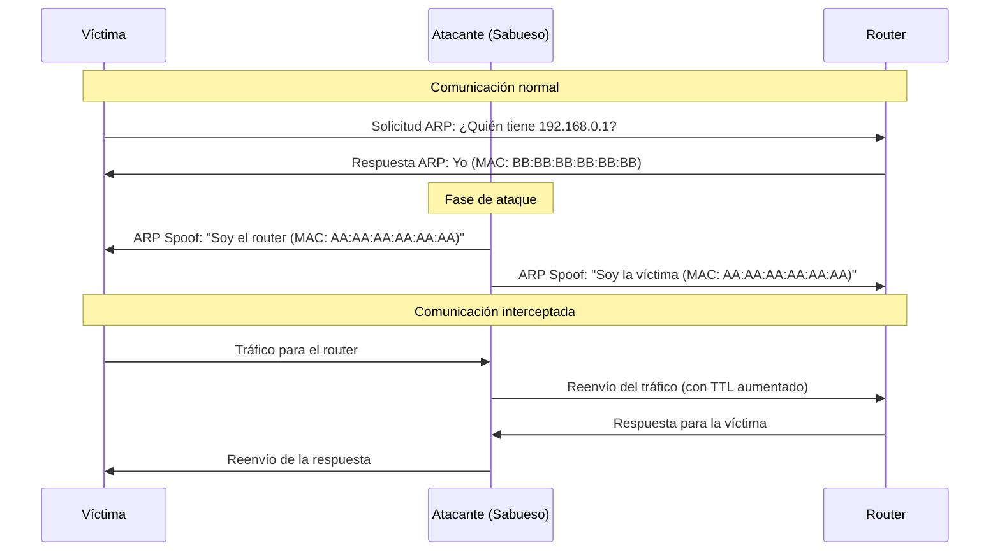

# Sabueso-Mitm - Herramienta de Intercepción de Tráfico

<p align="center">
  
</p>

## 🔍 Descripción

**Sabueso-Mitm** es un experimento avanzado de _Man-in-the-Middle_ (MITM) que permite interceptar y analizar tráfico HTTP/HTTPS entre dispositivos en una red local. Diseñado con propósitos de experimentación personal, **no me hago responsable de su uso malicioso**.

⚠️ **ADVERTENCIA CRÍTICA**  
Realizar este tipo de actividades en redes que no te pertenecen es **ILEGAL** y puede acarrear graves consecuencias legales.


## 🔄 ¿Qué es un ataque Man-in-the-Middle (MITM)?
Un ataque Man-in-the-Middle (MITM) es una técnica donde un atacante se posiciona encubiertamente entre dos dispositivos que se comunican (por ejemplo, entre un usuario y un router) para interceptar, modificar o inyectar datos en la comunicación.

### 🎯 Objetivos comunes de este tipo de ataques:

- Escuchar tráfico: Capturar datos sensibles como credenciales o mensajes

- Manipulación: Alterar el contenido de la comunicación

- Suplantación: Hacerse pasar por uno de los extremos de la comunicación

---

## 🧠 ¿Cómo funciona Sabueso-mitm?


Solo se especializa en el tráfico web (protocolo HTTP / HTTPS)

---

## 📡 ¿Qué información se obtiene?

### 🔒 Tráfico HTTPS
- IP de la víctima
- IP del sitio web visitado
- Hostname del sitio (si es resoluble)
```plaintext
[+] host --> example.com
[+] ip numérica --> 93.184.216.34
[+] ipv4 implicado --> 192.168.1.15
```

### 🌐 Tráfico HTTP (¡Cuidado! Información sensible)
- Contenido completo de paquetes no cifrados
- Credenciales de formularios
- Actividad de navegación
```plaintext
[+] protocolo http detectado
[+] IP inicial: 192.168.1.15 --> IP destino: 142.250.185.206
[+] info del paquete:
    GET /login HTTP/1.1
    Host: example.com
    User-Agent: Mozilla/5.0
    ...
    username=test&password=12345
```

---

## ⚙️ Características Técnicas

- 🎯 Ataque ARP-MITM entre dispositivos objetivo
- 👂 Sniffing de protocolos HTTP/HTTPS en tiempo real
- 💾 Opción para guardar datos capturados en archivos
- 🧹 Limpieza automática de reglas de iptables (Ctrl+C)
- � Manipulación de TTL para evitar pérdida de paquetes
- 🐧 Compatibilidad exclusiva con Linux
- 🧵 Ejecución multihilo para sniffing paralelo

---

## 📋 Requisitos Mínimos

| Componente | Requerimiento |
|------------|---------------|
| **Sistema Operativo** | Linux (kernel 4.x+) |
| **Permisos** | Ejecución como **root** (`sudo`) |
| **Python** | Versión 3.8+ |
| **Dependencias** | `scapy`, `colorama` |

```bash
# Instalar dependencias:
pip install scapy colorama
```

---

## 🚀 Instalación Rápida

```bash
git clone https://github.com/Urban20/Sabueso-Mitm.git
cd Sabueso-Mitm
pip install -r requirements.txt
```

---

## 🕹️ Parámetros de Ejecución

| Parámetro | Descripción | Obligatorio |
|-----------|-------------|-------------|
| `-m1`, `--maq1` | IP del primer objetivo | ✅ |
| `-m2`, `--maq2` | IP del segundo objetivo | ✅ |
| `-if`, `--interfaz` | Interfaz de red para sniffing | Solo con `-sf` |
| `-sf`, `--sniff` | Habilita modo sniffing | ❌ |
| `-db`, `--debug` | Guarda errores en `stderr.log` | ❌ |

---

## 💻 Ejemplos de Uso

### 🔄 Solo MITM (Interrupción de conexión)
```bash
sudo python3 mitm.py -m1 192.168.0.10 -m2 192.168.0.1
```
*Ideal para pruebas de interrupción de servicio entre dispositivos (D.O.S)*

### 👂 MITM + Sniffing (Análisis de tráfico)
```bash
sudo python3 mitm.py -m1 192.168.0.10 -m2 192.168.0.1 -if eth0 -sf
```
*Configuración típica para análisis de tráfico víctima→router*

### 🔍 Con guardado de datos HTTPS
```bash
sudo python3 mitm.py -m1 192.168.0.10 -m2 192.168.0.1 -if wlan0 -sf
```
*Durante la ejecución, ingresar `0` cuando solicite guardar datos*

---

## ⚠️ Limitaciones Conocidas

1. **Protección Cloudflare**: IPs protegidas no revelan el hostname real
2. **HTTPS Moderno**: No descifra contenido cifrado (solo muestra metadatos)
3. **Estabilidad**: Puede causar interrupciones de red en objetivos
4. **SOPORTE**: Solo compatible con redes IPv4

---

## ⭐ Apoyá el Proyecto

Si te gusta mi proyecto, dale una estrellita

### Con esto me ayudas a:

- 📈 Aumentar la visibilidad del proyecto

- 🚀 Motivarme a seguir desarrollando mejoras

- 🔍 Permitir que más personas lo descubran

